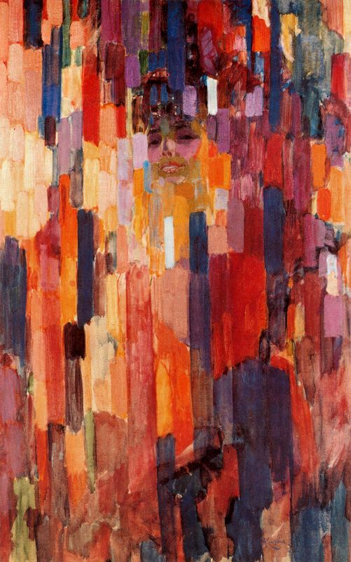
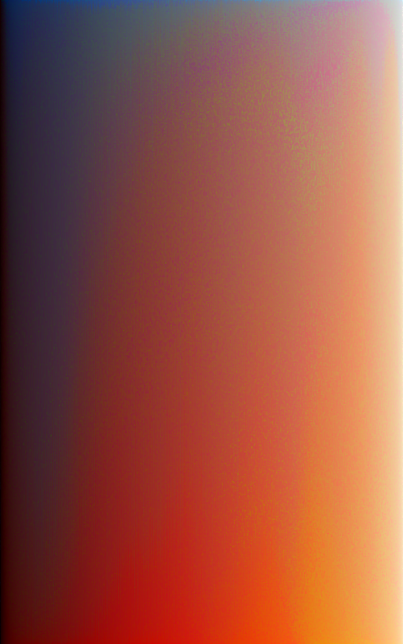

# paintingReorganize

## To install:

pip install -r requirements.txt

If that doesn't work you will have to manually track down and install these pip packages.

## To use:

python palette.py /path/to/input_file.jpg

Output will be written to output.png

## Example:

## How it works
Mostly based on PCA [a little tutorial on what that means here](https://www.quora.com/Where-can-I-find-a-detailed-tutorial-about-the-principal-component-analysis)
1. Organize pixels according to their first principal component (the direction along which variance is greatest)
2. Grab a column of pixels at a time, and organize them according to their first principal component
3. Use the resulting columns one by one in the final result. With each column, check to see if flipping it upside down gives a better match.
