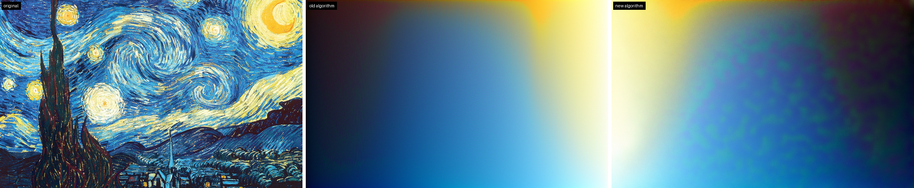
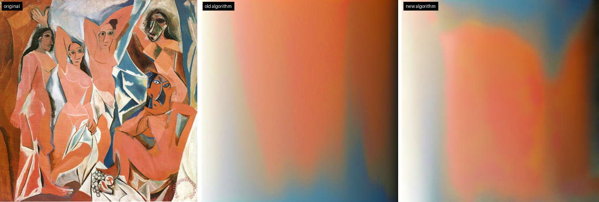
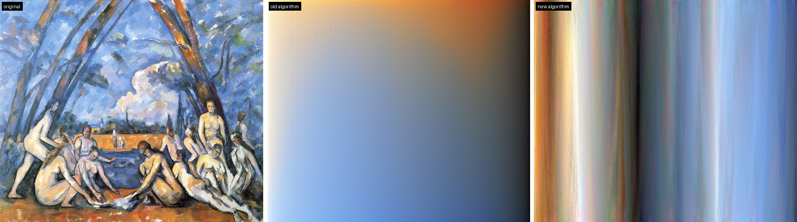
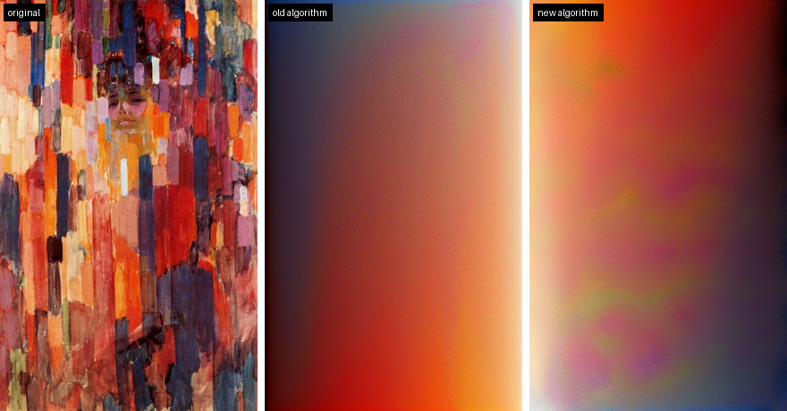

# paintingReorganize

Reorganize the pixels of a painting into a smooth color palette: the
output contains **exactly the same pixels** as the input, in the same
dense rectangle, rearranged so the color field is as visually smooth as
possible.

## To install

    pip install -r requirements.txt

## To use

    python smooth_palette.py /path/to/input_file.jpg [output.png]

Output is written to `output.png` unless a second argument is given.

(`palette.py` is the original Python 2 algorithm, kept for reference.)

## Examples — before and after

Each demo shows: the original painting, the output of the old
algorithm, and the output of the new one.

Van Gogh — Starry Night

Picasso — Demoiselles D'Avignon

Cezanne — The Large Bathers

Kupka — Mme Kupka Among Verticals

## The loss: what "smooth" means

The old algorithm implicitly optimized the *sum* of adjacent-pixel color
differences.  That loss barely distinguishes a gentle 50-pixel ramp from
one razor-sharp seam carrying the same total change — so its outputs
could concentrate all the color variation into specks, mismatched
columns, and hard edges.

The new loss is a multi-scale Huber penalty in CIELab.  Every pixel pair
at offset *s* ∈ {1, 2, 4, 8} (weighted 1/s²) pays, for its color
distance *d*:

    huber(d) = d²                  if d ≤ τ·s
               τ·s · (2d − τ·s)    otherwise

* **Quadratic below the threshold**: many small steps are much cheaper
  than one mid-size step, so transitions spread into even ramps, and an
  isolated speck (large *d* against every neighbor) is maximally
  expensive.
* **Linear above the threshold**: when the palette has a true gap that
  no rearrangement can hide (Starry Night's blues vs oranges), the
  cheapest rendering is one short, straight, crisp frontier — a linear
  penalty is sparsity-promoting, so frontiers come out few and clean
  instead of dithered into noise.
* Thresholds scale with the offset, so a perfect linear ramp stays in
  the quadratic regime at every scale; mid-scale seams and blocks do
  not.

## The algorithm

1. **Palette sweep (x-axis).**  Fit a principal curve through the
   pixel cloud in Lab space (iterated Hastie–Stuetzle, seeded by PCA).
   Sorting pixels by their position along this curve and slicing into
   columns makes the horizontal axis sweep the palette.  Unlike a
   straight PCA sort, the curve *bends* with the color distribution, so
   distinct color clusters never collapse onto the same column.
2. **Vertical order (y-axis).**  Within each column, pixels are sorted
   by their global *manifold rank* — a 1D ordering from recursive PCA
   splits (with seam-minimizing flips at every merge) that keeps every
   color cluster contiguous.  The ranking is the same for every column,
   so equal colors sort to equal heights: bands line up across columns,
   and minority colors form contiguous runs instead of scattered specks.
3. **Column alignment.**  Each column is re-sorted so its colors line
   up row-by-row with its neighbors, straightening band boundaries.
4. **Polish.**  Greedy descent on the exact loss: millions of candidate
   short-range swaps, proposed on independent sets so each accepted swap
   is an exact improvement, until convergence.

A cautionary note from the experiments in this rewrite: self-organizing
approaches that repeatedly match pixels to a blurred target reach
*lower* loss values but sprinkle isolated dots the eye immediately
notices — the mean-field target can't tell that a lone speck belongs in
a distant region of its own color.  Greedy descent on the exact loss
never creates specks.  Where metric and eye disagreed, the eye won.

Regenerate all demos and scores with:

    python make_demos.py
